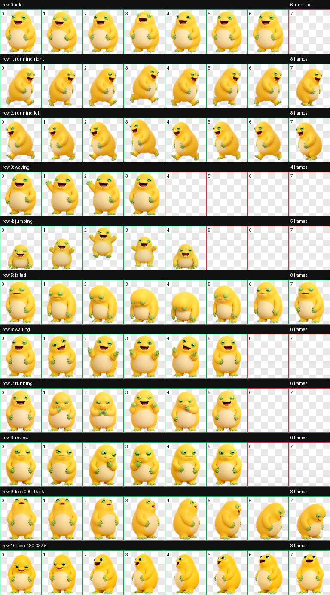

# 奶蛙 / Milk Frog

一个适用于 Codex 的 v2 动画宠物：黄色胖圆头、绿色眼皮、短蹼脚，整体是软胶 3D 玩具风格。



## 安装

将 `pet/` 目录复制为：

```text
~/.codex/pets/naiwa/
  pet.json
  spritesheet.webp
```

重新打开 Codex 后，选择名为“奶蛙”的宠物。

## 规格

- `spriteVersionNumber`: `2`
- 图集尺寸：`1536 × 2288`
- 单元尺寸：`192 × 208`
- 图集布局：`8 × 11`
- 标准动画：idle、running-right、running-left、waving、jumping、failed、waiting、running、review
- 环视动画：16 个方向，按 22.5° 顺时针递进

## 目录

- `pet/`：可直接安装的宠物包
- `source/`：无损图集、生成主图、动画长条、提示词与方向机制
- `qa/`：确定性校验及方向语义检查结果
- `preview/`：动作和方向预览

## 生成说明

视觉源文件由 OpenAI ImageGen 生成，并通过 hatch-pet v2 流程完成帧提取、透明背景处理、图集装配和 QA。公开仓库不包含搜索阶段使用的第三方参考图。

## License

MIT，详见仓库根目录的 `LICENSE`。
